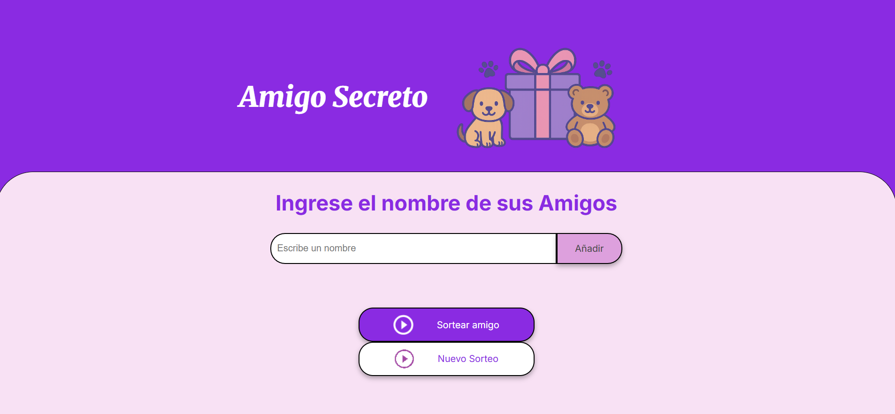

# Amigo Secreto 🎉
Proyecto realizado para la Formación de One Next Education de Alura Latam para Principiantes en Programación
Amigo Secreto es una aplicación interactiva que permite organizar sorteos de intercambio de regalos entre amigos, familiares o compañeros de manera rápida y sencilla. Desarrollada con JavaScript, a partir de una estructura de HTML5 y una hoja de estilo CSS.

##  Capturas de pantalla 📸

## Tecnologías utilizadas 💻
- HTML
- CSS
- JavaScript
  
## Funcionalidades 🔗
- Agregar nombres de participantes mediante un formulario.
- Mostrar la lista de participantes en tiempo real.
- Realizar el sorteo de forma aleatoria y mostrar el resultado en pantalla.
- Reiniciar el sorteo y limpiar la lista de participantes.

## Validaciones ⚠️
- **Campo vacío:** Se mostrará un mensaje de alerta pidiendo ingresar un nombre.
- **Nombre duplicado:** Se muestra un mensaje de alerta indicando que ese nombre ya está en la lista.
- **Nombre con números o caracteres especiales:** Se mostrará un mensaje de alerta indicando que solo se permiten letras.
- **Sorteo sin participantes:** Si no hay nombres, la app alerta que no hay participantes para sortear.

##  Capturas de pantalla 📸

## Tecnologías utilizadas 💻
- HTML
- CSS
- JavaScript

## Autor 📄 
Marcela Aros
